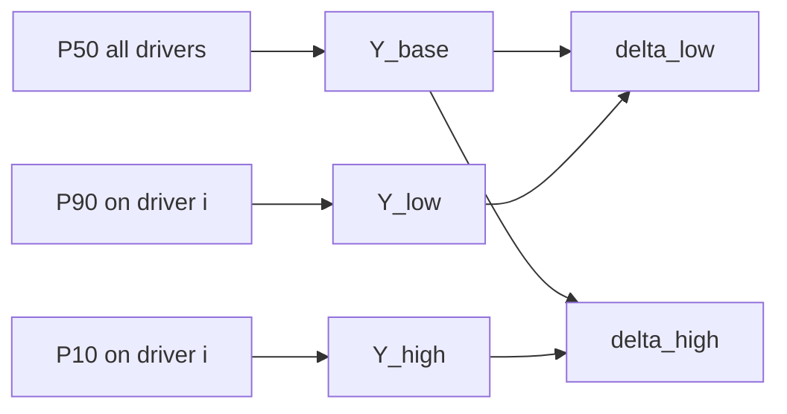

# Plan: Workbook-style perturbation tornado (P10/P90 OAT)

**Status:** Shipped (2026-05-26) — engine, API, Charts UI, tests, docs.

## Goal

Add a **classical tornado** next to the existing **Spearman MC tornado** on the Charts page. The new chart shows one-at-a-time (OAT) swings using **P50 base case** and **P90 / P10** representative input values (MMRA P10-large convention).

## Theory

### Current chart (keep as-is)

- **Spearman ρ** between each MC input vector and output vector (same iteration index).
- Ranks drivers by monotonic association in the joint sample.
- See [`frontend/src/utils/sensitivity.ts`](../frontend/src/utils/sensitivity.ts).

### New chart (workbook OAT)

For each active input driver \(X_i\):

1. **Base:** all drivers at **P50** → \(Y_{\text{base}} = f(\ldots)\)
2. **Low swing:** \(X_i\) at **P90** (conservative/smaller input), others P50 → \(Y_{i,\text{low}}\)
3. **High swing:** \(X_i\) at **P10** (upside/larger input), others P50 → \(Y_{i,\text{high}}\)

Bar values:

- \(\Delta_{\text{low}} = Y_{i,\text{low}} - Y_{\text{base}}\)
- \(\Delta_{\text{high}} = Y_{i,\text{high}} - Y_{\text{base}}\)

Sort bars by \(\max(|\Delta_{\text{low}}|, |\Delta_{\text{high}}|)\).

| Topic | Decision |
|-------|----------|
| Correlations | **Not used** in OAT (standard workbook); state clearly in UI |
| Chance / Pg | Out of scope v1 |
| Fixed input | P90 = P50 = P10 → zero swing, list as “fixed” |
| Toggles | Same active drivers as Spearman (`apply_oil_recovery`, `include_solution_gas`, method-aware list) |
| Sign | Comes from volumetric formula (e.g. FVF → negative \(\Delta_{\text{high}}\) on STOIIP) |

## Implementation

### 1. Engine — representative values

**File:** [`engine/mmra_engine/distributions.py`](../engine/mmra_engine/distributions.py) (or `distribution_repr.py`)

- `distribution_repr_values(dist) -> {p50, p90, p10}`
  - `fixed` → single value
  - `normal` / `lognormal` / `beta` → `p50`, `p90`, `p10` on `DistributionDef`
  - `triangular` → min/mode/max or percentiles when set

### 2. Engine — scalar volumetric evaluation

**New file:** `engine/mmra_engine/perturbation_tornado.py`

- `evaluate_volumetrics_scalar(inp, scalars) -> dict` — one deterministic pass using [`volumetrics.py`](../engine/mmra_engine/volumetrics.py); mirror oil/gas branches from [`simulation.py`](../engine/mmra_engine/simulation.py)
- Support `area_net_pay_yield` and `nrv_grv_yield`
- Honor calculation toggles from [`calculation_toggles.py`](../engine/mmra_engine/calculation_toggles.py)
- `compute_perturbation_tornado(inp, target_key) -> PerturbationTornadoResult`

### 3. Backend API

- Schema: `PerturbationTornadoRequest { input, target }`
- Route: `POST /api/simulate/tornado-perturbation`
- [`engine_adapter.py`](../backend/app/services/engine_adapter.py) + health `api_features`

**Does not require** `include_arrays` or re-running 5k MC.

### 4. Frontend

- Types + `api.fetchPerturbationTornado()` with `prepareInputForApi`
- New `PerturbationTornadoChart.tsx` — diverging horizontal bars (low left, high right)
- [`Charts.tsx`](../frontend/src/pages/Charts.tsx) — toggle: **Spearman (MC)** | **Workbook OAT (P10/P90)**

**UI copy:** OAT ignores correlations; input P90/P10 labels use P10-large convention.

### 5. Tests

| Layer | Cases |
|-------|--------|
| Engine | Oil formula case hand-check one driver; fixed input zero swing; recovery off; NRV GRV |
| Backend | POST returns 200, sorted drivers |
| Frontend | `npm run build` |

## Implementation order

1. `distribution_repr_values` + tests  
2. `evaluate_volumetrics_scalar` + oil formula check  
3. `compute_perturbation_tornado`  
4. API endpoint  
5. UI chart + Charts integration  
6. Update `PLAN.md` / `MEMORY.md`  

## Out of scope (v1)

- Pg tornado, two-way interactions, PNG export, replacing Spearman chart  
- Complex-trap scenario OAT (use P50 scalar trap logic only)

## Success criteria

- OAT tornado loads from current project input without MC arrays  
- Area/porosity rank highly on STOIIP; FVF negative when stochastic  
- Fixed drivers listed with no bars  
- All regression gates pass
